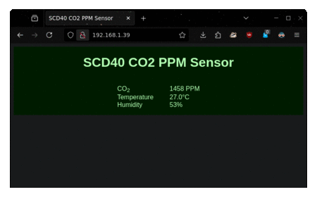
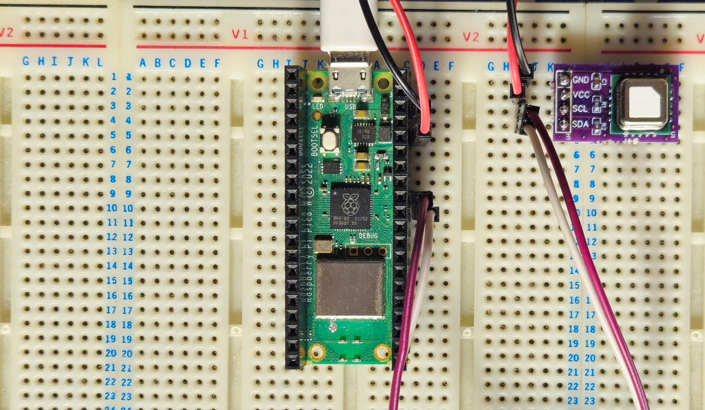

# scd40-rusty-pi



A Raspberry Pi Pico W implementation of a SCD40 based CO2 PPM monitor, it has a
web interface where the current values can be viewed. This is designed to work
with an I2C SCD40 module.

Please note that I am on about day 5 of learning Rust, so this code is not
provided with the intention of it being a correct example to follow. Comments
and feedback are welcomed! This is part of my own learning process.

***This is a work in progress.***



## Compiling - picoserve mod

I struggled to get `embassy` + `picoserve` to compile together using crates.io
sources. Despite the version number of `embassy` being the same it seems that
using the git sources fixes the problem (the issue is with
`embassy-time-driver`). But to achieve this I had to also edit the
`picoserve/Cargo.toml` in the `picoserve` project, which I have checked out and
sat alongside this project tree and referenced directly in this project's
`Cargo.toml`. Hopefully in time the issue with the crates.io compatibility will
be resolved.

```diff
diff --git a/picoserve/Cargo.toml b/picoserve/Cargo.toml
index 5bb0084..c9ad350 100644
--- a/picoserve/Cargo.toml
+++ b/picoserve/Cargo.toml
@@ -20,2 +20,2 @@ defmt = { version = "0.3.6", optional = true }
-embassy-net = { version = ">=0.6.0", optional = true, features = ["tcp", "proto-ipv4", "medium-ethernet"] }
-embassy-time = { version = ">=0.4.0", optional = true }
+embassy-net = { version = "0.7.0", git = "https://github.com/embassy-rs/embassy.git", optional = true, features = ["tcp", "proto-ipv4", "medium-ethernet"] }
+embassy-time = { version = "0.4.0", git = "https://github.com/embassy-rs/embassy.git", optional = true }
```

## License

`scd40-rusty-pi` is licensed under either of

- Apache License, Version 2.0 ([LICENSE-APACHE](LICENSE-APACHE) or
  <http://www.apache.org/licenses/LICENSE-2.0>)
- MIT license ([LICENSE-MIT](LICENSE-MIT) or <http://opensource.org/licenses/MIT>)

at your option.

## Contribution

Unless you explicitly state otherwise, any contribution intentionally submitted
for inclusion in the work by you, as defined in the Apache-2.0 license, shall
be dual licensed as above, without any additional terms or conditions.
